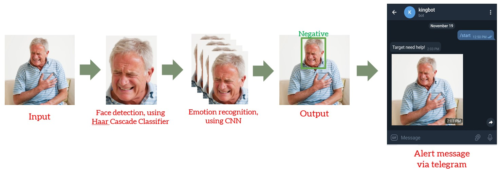

# Real Time Detection of Facial Expression
 A tool that can auto-send an instant alert to specific person via telegram whenever negative facial expression (eg. pain) is detected in the live camera. It is helpful in knowing any emergency needs for an elderly living alone.

### Working Principle
 The camera will periodically capture images. For each image, human face will be detected by Haar Cascade Classifier and the face image will be cropped out. The face image will be passed to a simple Convolutional Neural Network (CNN) and classify the facial expression. When pain emotion is detected in consecutive images, an alert message together with a captured image will be sent to a specific person through telegram chatbot. 

