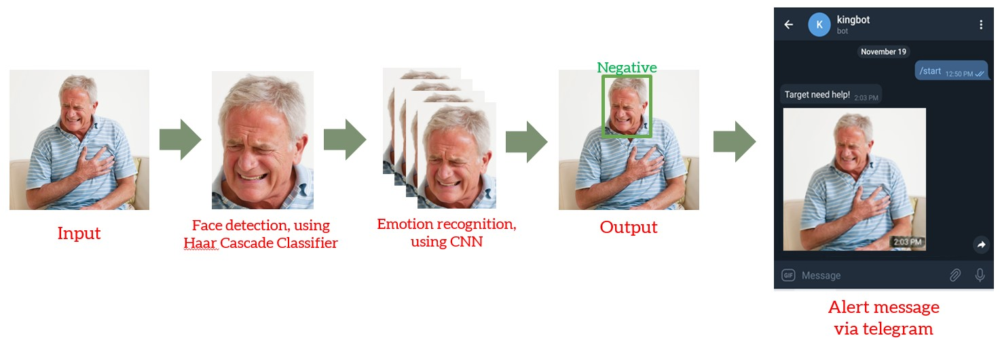
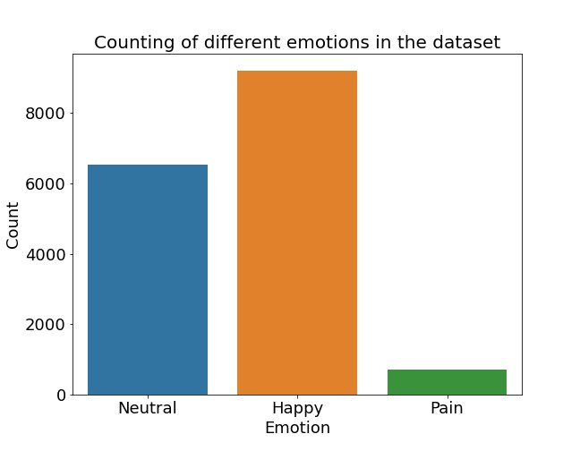
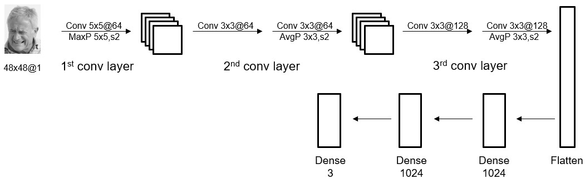
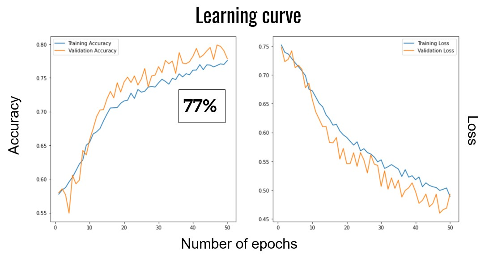

# Real Time Detection of Facial Expression
 A tool that can auto-send an instant alert to specific person via telegram whenever negative facial expression (eg. pain) is detected in the live camera. It is helpful in knowing any emergency needs for an elderly living alone.

### Working Principle
 Once the camera is started, it will periodically capture images. For each image, human face will be detected by Haar Cascade Classifier and the face image will be cropped out. The face image will be passed to a simple Convolutional Neural Network (CNN) and classify the facial expression. When pain emotion is detected in consecutive images, an alert message together with a captured image will be sent to a specific person through telegram chatbot. 
 

### Data source for CNN training
 For 'Neutral' and 'Happy' emotion images, they come from [FER2013 in kaggle](https://www.kaggle.com/nicolejyt/facialexpressionrecognition).
 
 For 'Pain' emotion images, they come from [2D face sets](http://pics.stir.ac.uk/2D_face_sets.htm). Since the number of 'pain' images is far lower than that of 'Neutral' and 'Happy', selfies of our 'pain' expression are also used. 
 
 
 
 ### Image data preprocessing
  As the images from FER2013 are in greystyle, all 'pain' emotion images will also be converted into greystyle before training. Also, the FER2013 images are given in ndarray with fixed length (i.e. 2304), all image input shapes for model training will be 48x48x1. 
  
  To avoid overfitting of the model, data augmentation is applied, including:
  - Rotation
  - Shearing
  - Zoom
  - Shifting
  - Flipping
  
  
### CNN Model training  
 The model architecture is mainly from [DeepFace library](https://pypi.org/project/deepface/). Its emotion classification model has 7 targets (ie. angry, disgust, fear, happy, sad, surprise, neutral).  Since 'pain' (our major target) is absent, we will use our image dataset to retrain the model in order to classify our three targets (ie. Neutral, Happy, Pain). 
 
 Model architecture: 
 
 
 
